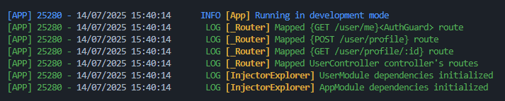
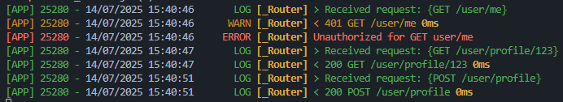

# ⚡ Noxus — The NestJS-Inspired Framework Built for Electron

Noxus brings the elegance and power of NestJS-like architecture to Electron applications — but with a purpose-built design for IPC and MessagePort communication instead of HTTP.

While NestJS is an excellent framework for building web servers, it is not suited for Electron environments where communication between the main process and the renderer is critical.

Transferring data between these using a local server and using HTTP request would be a waste of resources for the user's target device.

Noxus fills that gap.

✅ Use of decorators

✅ Use of dependency injection, with lifetimes management (singleton, scope, transient)

✅ Modular architecture with the use of modules, defining a map of controllers and services

✅ Automatic and performant controller and route registration with path and method mapping

✅ A true request/response model built on top of MessagePort to look like HTTP requests

✅ Custom exception handling and unified error responses

✅ Decorator-based guard system for route and controller authorization

✅ Scoped dependency injection per request context

✅ Setup the electron application and communication with your renderer easily and with flexibility

✅ TypeScript-first with full type safety and metadata reflection

✅ Pluggable logging with color-coded output for different log levels

<sub>* If you see any issue and you'd like to enhance this framework, feel free to open an issue, fork and do a pull request.</sub>

## Installation

Install the package in your main process application, and in your renderer as well :

```sh
npm i @noxfly/noxus
```

> ⚠️ The default entry (`@noxfly/noxus`) only exposes renderer-friendly helpers and types. Import Electron main-process APIs from `@noxfly/noxus/main`.

## Basic use

When employing "main", we consider this is the electron side of your application.

When employing "renderer", this is the separated renderer side of your application.

However, you can feel free to keep both merged, this won't change anything, but for further examples, this will be done to show you where the code should go.

### Setup Main Process side

```ts
// main/index.ts

import { bootstrapApplication } from '@noxfly/noxus/main';
import { AppModule } from './modules/app.module.ts';
import { Application } from './modules/app.service.ts';

async function main(): Promise<void> {
    const noxApp = await bootstrapApplication(AppModule);

    noxApp.configure(Application);

    noxApp.start();
}

main();
```

> ℹ️ Note that you have to specify which service you'd like to see as your application root's service, so the framework can interact with it and setup things on it.

```ts
// main/modules/app.service.ts

import { IApp, Injectable, Logger } from '@noxfly/noxus/main';

@Injectable('singleton')
export class Application implements IApp {
    constructor(
        private readonly windowManager: WindowManager, // An Injectable too
    ) {}

    // automatically called by the bootstrapApplication function
    // once it is all setup
    public async onReady(): Promise<void> {
        Logger.info("Application's ready");
        this.windowManager.createMain(); // Your custom logic here to create a window
    }
}
```

```ts
// main/modules/app.module.ts

import { Module } from '@noxfly/noxus/main';

@Module({
    imports: [UsersModule], // import modules to be found here
    providers: [], // define services that should be found here
    controllers: [], // define controllers that this module has to create a route node
})
export class AppModule {}
```

> ℹ️ Note that we do not register Application service in it because it already has been registered when bootstraping the application.

```ts
// main/modules/users/users.module.ts

import { Module } from '@noxfly/noxus/main';

@Module({
    providers: [UsersService],
    controllers: [UsersController],
})
export class UsersModule {}
```

```ts
// main/modules/users/users.service.ts

import { Injectable } from '@noxfly/noxus/main';

@Injectable()
export class UsersService {
    public async findAll(): Promise<User[]> {
        // ...
    }

    public async findOneById(id: string): Promise<User> {
        // ...
    }
}
```

> ℹ️ You can specify the lifetime of an injectable passing a value in the decorator, between `singleton`, `scope` or `transient` (default to `scope`).

```ts
// main/modules/users/users.controller.ts

import { Controller, Get } from '@noxfly/noxus/main';
import { UsersService } from './users.service.ts';

@Controller('users')
export class UsersController {
    constructor(
        private readonly usersService: UsersService,
    ) {}

    @Get('all')
    public getAll(): Promise<User[]> {
        return await this.usersService.findAll();
    }

    @Get('profile/:id')
    @Authorize(AuthGuard)
    public getProfile(IRequest request, IResponse response): Promise<User | undefined> {
        return await this.usersService.findOneById(request.params.id);
    }
}
```

Further upgrades might include new decorators like `@Param()`, `@Body()` etc... like Nest.js offers.

```ts
// main/guards/auth.guard.ts

import { IGuard, Injectable, MaybeAsync, Request } from '@noxfly/noxus/main';

@Injectable()
export class AuthGuard implements IGuard {
    constructor(
        private readonly authService: AuthService
    ) {}

    public async canActivate(IRequest request): MaybeAsync<boolean> {
        return this.authService.isAuthenticated();
    }
}
```

Here is the output (not with that exact same example) when running the main process :




### Setup Preload

We need some configuration on the preload so the main process can give the renderer a port (MessagePort) to communicate with. Everytime this is requested, a new channel is created, an d the previous is closed.

```ts
// main/preload.ts

import { exposeNoxusBridge } from '@noxfly/noxus';

exposeNoxusBridge();
```

The helper uses `ipcRenderer.send('gimme-my-port')`, waits for the `'port'` response, starts both transferred `MessagePort`s, and forwards them to the renderer with `window.postMessage({ type: 'init-port', ... }, '*', [requestPort, socketPort])`. If you need to customise any channel names or the exposed property, pass `exposeNoxusBridge({ exposeAs: 'customNoxus', requestChannel: 'my-port', responseChannel: 'my-port-ready', initMessageType: 'custom-init' })`.

> ⚠️ As the Electron documentation warns, never expose the full `ipcRenderer` object. The helper only reveals a minimal `{ requestPort }` surface under `window.noxus` by default.


### Setup Renderer

Noxus ships with a `NoxRendererClient` helper that performs the renderer bootstrap: it asks the preload bridge for a port, expects two transferable `MessagePort`s (index `0` for request/response and index `1` for socket pushes), wires both, and exposes a promise-based `request`/`batch` API plus the `RendererEventRegistry` instance.

By default it calls `window.noxus.requestPort()`—the value registered by `exposeNoxusBridge()`—but you can pass a custom bridge through the constructor options if needed.

Call `await client.setup()` early in your renderer startup (for example inside the first Angular service that needs IPC). Once the promise resolves, `client.request(...)` automatically includes the negotiated `senderId`, and socket events are routed through `client.events`.

```ts
// renderer/services/noxus.service.ts

import { Injectable } from '@angular/core';
import { from, Observable } from 'rxjs';
import {
    IBatchRequestItem,
    IBatchResponsePayload,
    IRequest,
    NoxRendererClient,
} from '@noxfly/noxus';

@Injectable({ providedIn: 'root' })
export class NoxusService extends NoxRendererClient {
    public async init(): Promise<void> {
        await this.setup();
    }

    public request$<T, U = unknown>(request: Omit<IRequest<U>, 'requestId' | 'senderId'>): Observable<T> {
        return from(this.request<T, U>(request));
    }

    public batch$<T = IBatchResponsePayload>(requests: Omit<IBatchRequestItem<unknown>, 'requestId'>[]): Observable<T> {
        return from(this.batch(requests) as Promise<T>);
    }
}

// Somewhere during app bootstrap
await noxusService.init();

// Subscribe to push notifications
const subscription = noxusService.events.subscribe('users.updated', (payload) => {
    console.log('Users updated:', payload);
});
```

If you need a custom bridge (for example a different preload shape), pass it via the constructor: `super({ bridge: window.customBridge })`. The class keeps promise-based semantics so frameworks can layer their own reactive wrappers as shown above.




### Error Handling

You have a bunch of `*Exception` classes that are at your disposal to help you have a clean code.

Replace `*` By any of the HTTP status code's name that is available in the list below.

If you throw any of these exception, the response to the renderer will contains the associated status code.

You can specify a message in the constructor.

You throw it as follow :
```ts
throw new UnauthorizedException("Invalid credentials");
throw new BadRequestException("id is missing in the body");
throw new UnavailableException();
// ...
```

| status code | class to throw                         |
| ----------- | -------------------------------------- |
| 400         | BadRequestException                    |
| 401         | UnauthorizedException                  |
| 402         | PaymentRequiredException               |
| 403         | ForbiddenException                     |
| 404         | NotFoundException                      |
| 405         | MethodNotAllowedException              |
| 406         | NotAcceptableException                 |
| 408         | RequestTimeoutException                |
| 409         | ConflictException                      |
| 426         | UpgradeRequiredException               |
| 429         | TooManyRequestsException               |
| 500         | InternalServerException                |
| 501         | NotImplementedException                |
| 502         | BadGatewayException                    |
| 503         | ServiceUnavailableException            |
| 504         | GatewayTimeoutException                |
| 505         | HttpVersionNotSupportedException       |
| 506         | VariantAlsoNegotiatesException         |
| 507         | InsufficientStorageException           |
| 508         | LoopDetectedException                  |
| 510         | NotExtendedException                   |
| 511         | NetworkAuthenticationRequiredException |
| 599         | NetworkConnectTimeoutException         |


## Advanced

### Injection

You can decide to inject an Injectable without passing by the constructor, as follow :

```ts
import { inject } from '@noxfly/noxus/main';
import { MyClass } from 'src/myclass';

const instance: MyClass = inject(MyClass);
```

### Circular Dependencies

Noxus solves circular dependencies using a forward reference pattern. When two classes depend on each other, you can use `forwardRef()` combined with either the `@Inject()` decorator or the `inject()` helper to lazily resolve the dependency.

**Using Constructor Injection (`@Inject`)**

```ts
import { Injectable, Inject, forwardRef } from '@noxfly/noxus/main';

@Injectable()
class ServiceA {
    constructor(
        @Inject(forwardRef(() => ServiceB)) 
        private readonly serviceB: ServiceB
    ) {}
}

@Injectable()
class ServiceB {
    constructor(
        private readonly serviceA: ServiceA
    ) {}
}
```

**Using Property Injection (`inject`)**

```ts
import { Injectable, inject, forwardRef } from '@noxfly/noxus/main';

@Injectable()
class ServiceA {
    // Lazily resolves ServiceB, avoiding infinite recursion during instantiation
    private readonly serviceB = inject(forwardRef(() => ServiceB));
}

@Injectable()
class ServiceB {
    private readonly serviceA = inject(ServiceA);
}
```

In both cases, a `Proxy` is returned, meaning the actual instance is only resolved when you access a property or method on it.

### Middlewares

Declare middlewares as follow :

```ts
// renderer/middlewares.ts

import { IMiddleware, Injectable, Request, IResponse, NextFunction } from '@noxfly/noxus/main';

@Injectable()
export class MiddlewareA implements IMiddleware {
    public async invoke(request: Request, response: IResponse, next: NextFunction): Promise<void> {
        console.log(`[Middleware A] before next()`);
        await next();
        console.log(`[Middleware A] after next()`);
    }
}

@Injectable()
export class MiddlewareB implements IMiddleware {
    public async invoke(request: Request, response: IResponse, next: NextFunction): Promise<void> {
        console.log(`[Middleware B] before next()`);
        await next();
        console.log(`[Middleware B] after next()`);
    }
}
```

It is highly recommended to `await` the call of the `next` function.

Register these by 3 possible ways :

1. For a root scope. Will be present for each routes.

```ts
const noxApp = bootstrapApplication(AppModule);

noxApp.configure(Application);

noxApp.use(MiddlewareA);
noxApp.use(MiddlewareB);

noxApp.start();
```

2. Or for a controller or action's scope :

```ts
@Controller('user')
@UseMiddlewares([MiddlewareA, MiddlewareB])
export class UserController {
    @Get('all')
    @UseMiddlewares([MiddlewareA, MiddlewareB])
    public getAll(): Promise<void> {
        // ...
    }
}
```

Note that if, for a given action, it has registered multiples times the same middleware, only the first registration will be saved.

For instance, registering MiddlewareA for root, on the controller and on the action is useless.

The order of declaration of use of middlewares is important.

assume we do this :
1. Use Middleware A for root
2. Use Middleware B for root just after MiddlewareA
3. Use Middleware C for controller
4. Use Middleware D for action
5. Use AuthGuard on the controller
6. Use RoleGuard on the action

Then the executing pipeline will be as follow :

```r
A -> B -> C -> D -> AuthGuard -> RoleGuard -> [action] -> D -> C -> B -> A.
```

if a middleware throw any exception or put the response status higher or equal to 400, the pipeline immediatly stops and the response is returned, weither it is done before or after the call to the next function.


## Listening to events from the main process

Starting from v1.2, the main process can push messages to renderer processes without the request/response flow.

```ts
// main/users/users.controller.ts
import { Controller, Post, Request, NoxSocket } from '@noxfly/noxus/main';

@Controller('users')
export class UsersController {
    constructor(private readonly socket: NoxSocket) {}

    @Post('create')
    public async create(request: Request): Promise<void> {
        const payload = { nickname: request.body.nickname };

        this.socket.emitToRenderer(request.event.senderId, 'users:created', payload);
        // or broadcast to every connected renderer: this.socket.emit('users:created', payload);
    }
}
```

On the renderer side, leverage the `RendererEventRegistry` to register and clean up listeners. The registry only handles push events, so it plays nicely with the existing request handling code above.

```ts
import { RendererEventRegistry, RendererEventSubscription } from '@noxfly/noxus';

private readonly events = new RendererEventRegistry();

constructor() {
    // ... after the MessagePort is ready
    this.port.onmessage = (event) => {
        if(this.events.tryDispatchFromMessageEvent(event)) {
            return;
        }

        this.onMessage(event); // existing request handling
    };
}

public onUsersCreated(): RendererEventSubscription {
    return this.events.subscribe('users:created', (payload) => {
        // react to the event
    });
}

public teardown(): void {
    this.events.clear();
}
```


## Contributing

1. Clone the repo
1. `npm i`
1. Develop
1. Push changes (automatically builds)
1. Create a PR

if you'd like to test your changes locally :
1. `npm run build`
1. from an electron project, `npm i ../<path/to/repo>`

